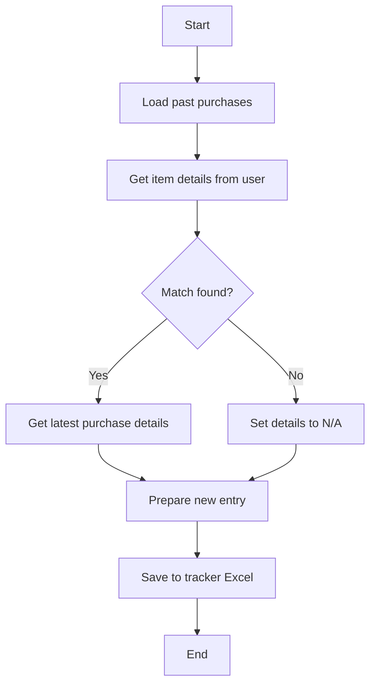

# 📦 Demand Work Flow Phase 1

A Python-based demand Workflow tool that records, retrieves, and manages purchase requests efficiently using Excel as the backend storage.

---

## 🚀 Features
- Load and track purchase details from an Excel file.
- Retrieve latest purchase information for repeated items.
- Automatically handles missing or unmatched data.
- Easy-to-use command-line interface.
- Uses `pandas` for efficient data handling.

---

## 📂 Installation

### 1️⃣ Clone this repository
```bash
git clone https://github.com/itsashishrawat/DemandWorkflowPhase1.git
cd DemandWorkflowphase1
```

### 2️⃣ Install dependencies
```bash
pip install pandas openpyxl
```

---

## 🛠️ Usage
Run the program with:
```bash
python Workflow.py
```
You will be prompted to:
1. Enter the item name.
2. Enter the required quantity.
3. View past purchase details (if available).
4. Save the new entry to the Excel tracker.

---

## 🔄 Program Flow


---

## 🖥️ Example
```
Enter Item Name: car
Enter Required Quantity: 3

Past Purchase Details Found:
  Last Price: 30000
  Last Purchase Date: 2024-10-15
  Vendor: maruti
  Category: motorvehicle

New entry saved to tracker.xlsx!
```

---

## 🧰 Tech Stack
- **Python 3.x**
- **pandas** — Data manipulation & analysis.
- **openpyxl** — Excel file reading/writing.

---

## 📌 Notes
- Ensure `tracker.xlsx` exists in the project directory before running.
- Non-date values in the date column will be converted to `NaT` (Not A Time) using `errors='coerce'` in pandas.

---
